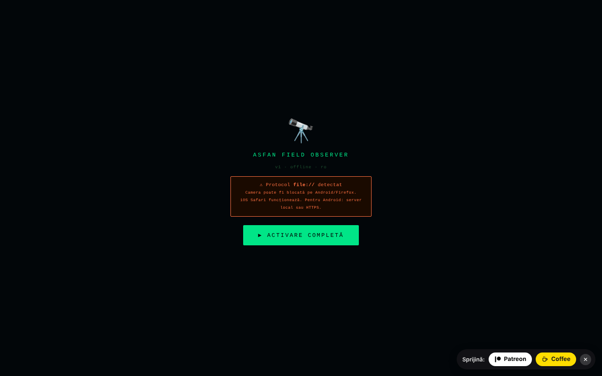

# Field Observer

Observator de teren pe telefon: GPS, busolă, mișcare, lumină, sunet, cameră, NFC și rapoarte salvate local.

**Live:** https://chiuta.github.io/FieldObserver/

## Ce este

ASFAN Field Observer (v1) este o aplicație single-file, gândită pentru telefon, care afișează în timp real datele senzorilor dispozitivului și permite salvarea de „rapoarte" de teren (date de senzori, notă, fotografie, înregistrare audio). Interfața este în română.

## Funcții

- Bară de stare: ceas, lumină (lux), rețea, nivel baterie, coordonate GPS.
- Buton „▶ ACTIVARE COMPLETĂ" care cere permisiunile necesare dintr-un singur gest; „RESET PERMISIUNI" pentru reluare.
- Vizor cu cameră (cameră spate/față; dublă atingere schimbă camera), cu suprapunere grafică.
- Panouri: **BUSOLĂ** (azimut și direcție), **MIȘCARE** (accelerație m/s², viteză unghiulară °/s), **AUDIO** (nivel în dB), **LUMINĂ** (lux, dacă senzorul există), **BATERIE**, **REȚEA**.
- Butoane: START (cameră), **FOTO**, **AUDIO** (înregistrare), **TORȚĂ** (dacă dispozitivul o permite), **NFC**, **SALVARE**, **ARHIVĂ**.
- Detectare de coduri QR / EAN-13 / Code 128 / Data Matrix / Aztec în imaginea camerei, acolo unde browserul suportă `BarcodeDetector`.
- Câmp de notă cu dictare vocală (`ro-RO`, dacă browserul oferă recunoaștere vocală), confirmări vocale („Raport salvat") și vibrații.
- Wake Lock pentru a ține ecranul aprins, acolo unde este disponibil.
- Arhivă de rapoarte: vizualizare foto, redare audio, partajare (Web Share sau copiere în clipboard), descărcare JSON, ștergere.

## Manual de utilizare

1. Deschideți pagina pe telefon, pe **HTTPS** sau `localhost` (camera nu funcționează pe HTTP nesecurizat; aplicația afișează un avertisment).
2. Apăsați „▶ ACTIVARE COMPLETĂ" și acordați permisiunile (locație, cameră, microfon, senzori de mișcare/orientare).
3. Urmăriți panourile BUSOLĂ, MIȘCARE, AUDIO, LUMINĂ, BATERIE, REȚEA.
4. Apăsați „START" pentru cameră; dublă atingere pe imagine schimbă camera. Folosiți „FOTO", „AUDIO" (pornire/oprire înregistrare) și „TORȚĂ".
5. Scrieți o notă în câmpul de text (sau dictați-o cu butonul de microfon).
6. Apăsați „SALVARE": raportul (timp, GPS, orientare, mișcare, lumină, baterie, rețea, notă, ultima fotografie / înregistrare audio) este salvat local. Dacă baza de date nu e disponibilă sau salvarea eșuează, se descarcă un fișier JSON.
7. „ARHIVĂ" listează rapoartele; din ea le puteți vizualiza, partaja, descărca (JSON) sau șterge.
8. „◈ NFC" pornește citirea etichetelor NFC (unde browserul suportă Web NFC).

## Confidențialitate și rețea

- **Stocare locală:** IndexedDB, baza `ASFAN_FO` (versiunea 2), magazia `recs` cu rapoartele (inclusiv foto și audio). Nu se folosește `localStorage`.
- **Rețea:** aplicația nu conține apeluri `fetch` și are o politică CSP cu `connect-src 'self'`; nu contactează hosturi terțe. Linkurile „Patreon" și „Coffee" se deschid doar la clic.
- Notă: dictarea vocală folosește funcția de recunoaștere vocală a browserului, care în unele browsere (de ex. Chrome) poate trimite audio către serviciul furnizorului browserului; aplicația nu controlează acest aspect.
- Fără analitice.

## Rulare locală / offline

Descărcați `index.html` și deschideți-l prin `localhost` (de ex. `python3 -m http.server 8080`) sau de pe un host HTTPS; senzorii și camera cer un context sigur. Nu necesită internet. Disponibilitatea senzorilor depinde de dispozitiv și de browser.

## Licență

CC0 1.0 Universal (domeniu public) — vezi fișierul LICENSE

## Autor

Alexio — Alexandru-Ionuț Chiuță. Contact: alexio@trom.tf

## English summary

Field Observer is a single-file, Romanian-language mobile field tool: live GPS, compass, motion, ambient light, audio level, camera with QR/barcode detection, torch and NFC, plus saved field reports (IndexedDB database `ASFAN_FO`) with notes, photo and audio, JSON export and sharing. No network requests (CSP connect-src 'self'). CC0 1.0.
